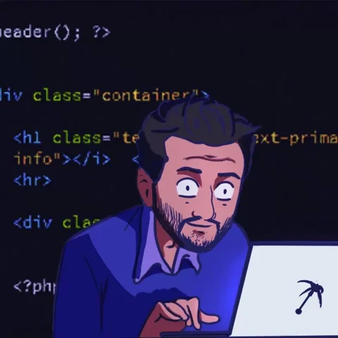

<!-- Heading -->
<h3 align="center"> Hola! Soy Alejandro </h3>
 
 

 <!-- About section -->

---

✨ Soy desarrollador de software polifacético y administrador de redes con más de 6 años de experiencia especializado en desarrollo Android (Java y Kotlin), desarrollo web (HTML, JS, React, Django) y administración de redes (Windows Server, MDaemon, VMWare).

Buscando aplicar habilidades probadas y conocimientos sólidos en una posición desafiante y dinámica que fomenta la innovación y el aprendizaje continuo.

<!-- code gif-->

- 💬 Preguntame sobre: Kotlin, Java, Building a Web Site, Django.

- 📫 Como contactarme: [@abermudez910827](https://twitter.com/abermudez910827)

- ⚡ Aficiones: Como entusiasta de la tecnología y profesional de la informática, encuentro un gran valor en seguir canales de tecnología que estimulen tanto mi aprendizaje continuo como mi curiosidad innata. Estos canales, que abarcan una variedad de plataformas como blogs, foros, YouTube, y podcasts, me proporcionan una visión actualizada de las tendencias emergentes, los avances tecnológicos y las mejores prácticas de la industria.

<!-- About section: END -->

## ⚡ Technologies

<!-- Conecct section -->

## 📱 Contacto

 

 <!-- Conecct section: END -->

  <!-- GitHub section -->

## Mis estadísticas en GitHub 

 
    

 
 
<!-- THE END -->
 
